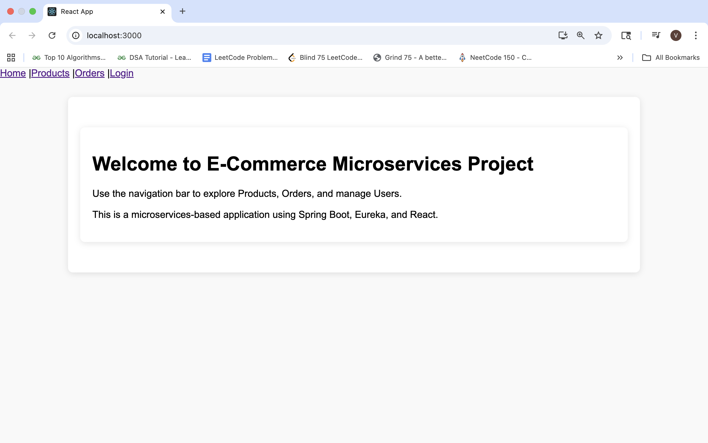
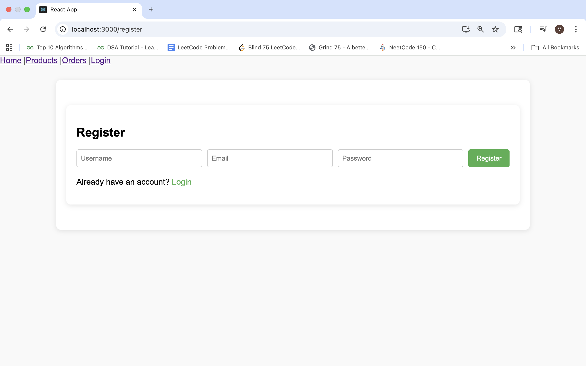
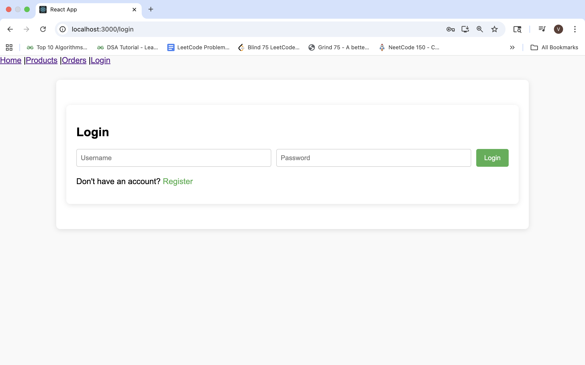
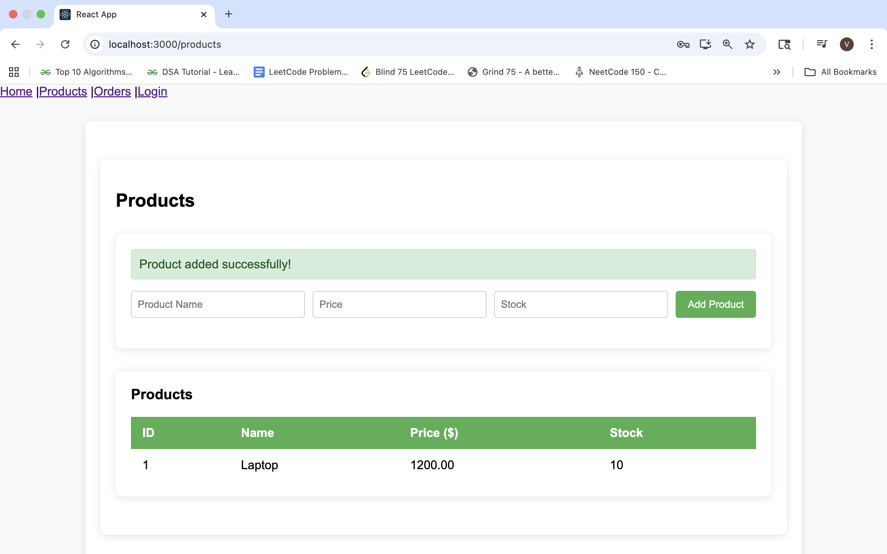
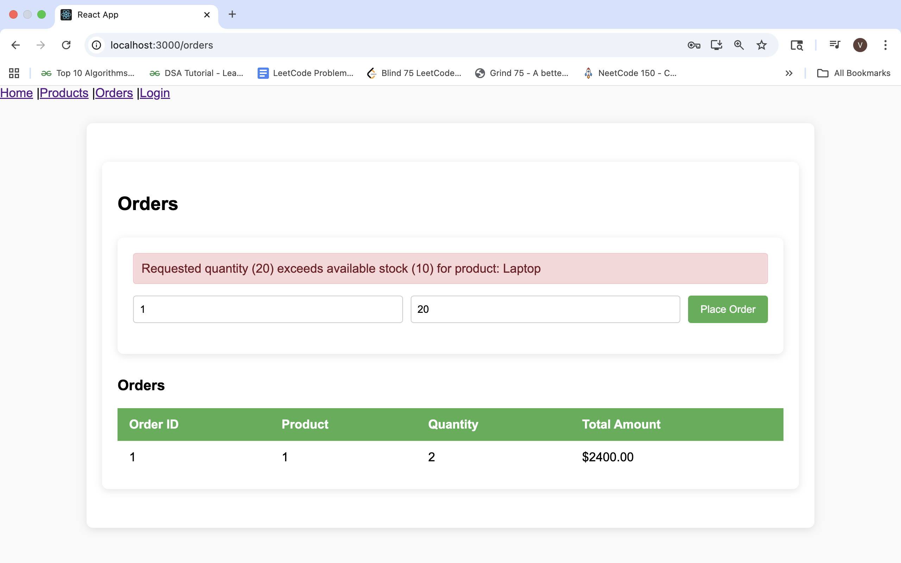
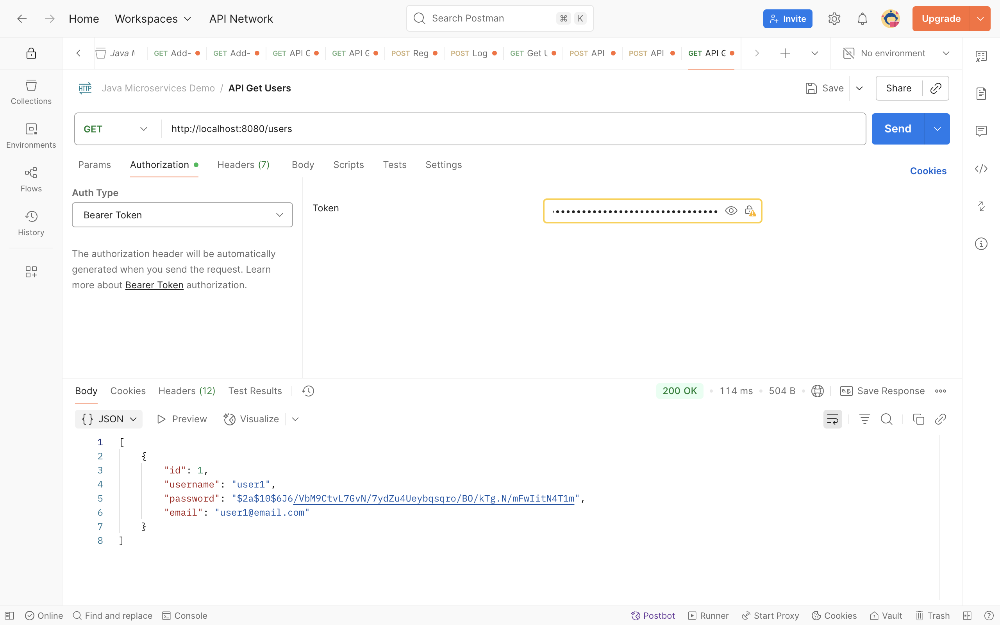

# Full-Stack-Microservices_ECommerce-Project
This project is a full-stack e-commerce application built with **Spring Boot (Microservices)** for the backend, **React** for the frontend, and **Docker** for containerization. 
It demonstrates a production-like setup with independent services, API gateway routing, service discovery, and a frontend consuming microservices APIs.

---

## 🛠️ Tech Stack

**Backend (Microservices):**
- Spring Boot 3.x
- Spring Cloud (Eureka, API Gateway)
- H2 (configurable)
- Maven

**Frontend:**
- React.js (Vite or CRA depending on your setup)
- Axios for API calls
- Bootstrap / Tailwind (if used)

**Containerization:**
- Docker
- Docker Compose

---

## 📂 Project Structure

```
Full-Stack-Microservices_ECommerce-Project/
│── microservicesdemo/    # Service Discovery
│── product-service/      # Product Management (Spring Boot + H2 DB)
│── order-service/        # Order Management (Spring Boot + H2 DB)
│── user-service/         # User Authentication (Spring Boot + H2 DB)
│── api-gateway/          # Spring Cloud Gateway
│── microservices-frontend/ # React Frontend
│── docker-compose.yml    # Docker orchestration
│── README.md             # Project Documentation
```

---

## 🛠️ Setup Instructions
### 1️⃣ Clone the Repository

```bash
git clone https://github.com/Pranavi2002/Full-Stack-Microservices_ECommerce-Project.git
cd Full-Stack-Microservices_ECommerce-Project
```

### 2️⃣ Backend Setup (Spring Boot Microservices)
Run Individually (without Docker):
Each microservice can be run using Maven:

```bash
cd product-service
mvn spring-boot:run
```

Do the same for order-service, user-service, api-gateway, and microservicesdemo.

For running in Eclipse IDE, right click on the main file, Run as, Java Application.

Backend services will be available at:

Eureka Server → http://localhost:8761

API Gateway → http://localhost:8080

### 3️⃣ Frontend Setup (React App)

```bash
cd microservices-frontend
npm install
npm start
```

Frontend will run at:
👉 http://localhost:3000

Make sure the backend (API Gateway) is running so the frontend can communicate with it.

### 4️⃣ Run with Docker (Recommended)

This project includes a docker-compose.yml to run all services together.

```bash
docker-compose up --build
```

This will start:
-Discovery Server (Eureka)
-API Gateway
-Product Service
-Order Service
-User Service
-React Frontend

Visit:
-Frontend → http://localhost:3000
-Eureka Dashboard → http://localhost:8761
-API Gateway → http://localhost:8080

To stop containers:

```bash
docker-compose down
```

---

### ✅ Features

- 🔑 User Service – Register, login, and manage users
- 📦 Product Service – Add, update, and view products
- 🛒 Order Service – Place and track orders
- 🌐 API Gateway – Single entry point for frontend
- 🗂️ Service Discovery – Eureka-based microservice registration
- 🐳 Dockerized – Easy to deploy with Docker Compose

---

## 📡 API Endpoints

All APIs are routed via API Gateway (http://localhost:8080)

### 🔹 Product Service
- GET /products → Get all products
- POST /products → Add a new product

### 🔹 Order Service
- GET /orders → Get all orders
- POST /orders → Place a new order

### 🔹 User Service
- GET /users → Get all users
- POST /users → Register new user

---

## 🚀 Project Flow

1. Open the app in your browser at **http://localhost:3000** → Landing (Home) page.  
2. From the **navbar**, navigate to the **Login page**.  
3. If new, click **Register** → upon successful registration, you’ll be redirected to the login page.  
4. Login with your credentials → on success, you’ll be redirected to the **Products page**.  
5. On the **Products page**:
   - Add a new product using the form.  
   - View all added products in the table below.  
6. Navigate to the **Orders page**:
   - Place an order for an existing product.  
   - If successful, the order will appear in the table.  
   - If unsuccessful, you’ll see an error message.  
7. ⚠️ Since this project uses an **H2 in-memory database**, all data is stored only during the current session.  
   - Restarting the app will clear all products and orders.  
8. See the registered users in Postman
    - Use the token generated during login, to see all the users.
---

## 📸 Screenshots

### Home


### Register


### Login


### Products


### Orders


### Error


### View All Users


---

## 🌱 Future Improvements

### Database Upgrade
- Swap H2 → MySQL/Postgres.
- Add persistence for Orders/Products.

### Central Config (Spring Cloud Config)
- Run one config server container.
- Keep all services’ configs in one Git repo.

### Security (JWT + API Gateway)
- Add an Auth service.
- Secure endpoints with JWT tokens.

### Monitoring & Logs (nice-to-have)
- Add Spring Boot Admin or Prometheus + Grafana to watch services.

### Cloud Deployment (optional but powerful)
- Deploy the Compose setup to Azure/AWS/GCP.

---

## 👩‍💻 Author
### Pranavi Kolipaka
Feel free to connect: 
- [LinkedIn] (https://www.linkedin.com/in/vns-sai-pranavi-kolipaka-489601208/)  
- [GitHub] (https://github.com/Pranavi2002)